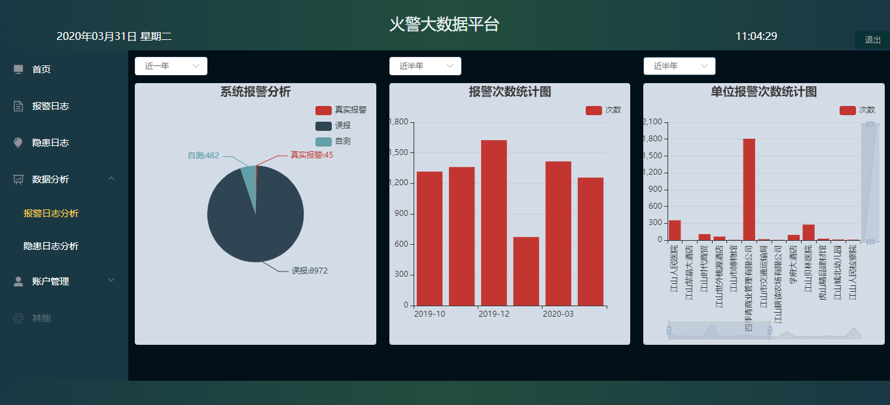

# 火警大数据平台

## 项目介绍

本项目基于 vue 框架，完成某市符合国家消防规定单位的火警信息，以及火警信息的历史记录、实时报警记录展示功能。

## 项目构建

```bash
npm install
npm run dev
```

PS: 默认 8080 端口

## 项目技术栈

- vue-cli
- vue
- vue-axios
- vue-router
- webpack
- Vuex
- Element UI
- Echarts
- express

## 功能展示

- 登录
  

- 注册
  

- 主界面
  

- 单位信息
  

- 报警日志
  

- 隐患日志
  

- 数据分析  
 近一年：
 
 近半年：
 
 近一个月：
 
- 修改用户信息
  

- 实时报警弹窗
  

- 用户名、密码校验
 
 
## 日志

第一次测试后： 1.跨域问题 2.路由导航改了 3.常量 魔法数 4.几个地方的时间戳还没有转换 5.请求相应格式
6.cookie 中带 token 7.隐患日志未完善 8.页数有问题 9.时间戳转换
